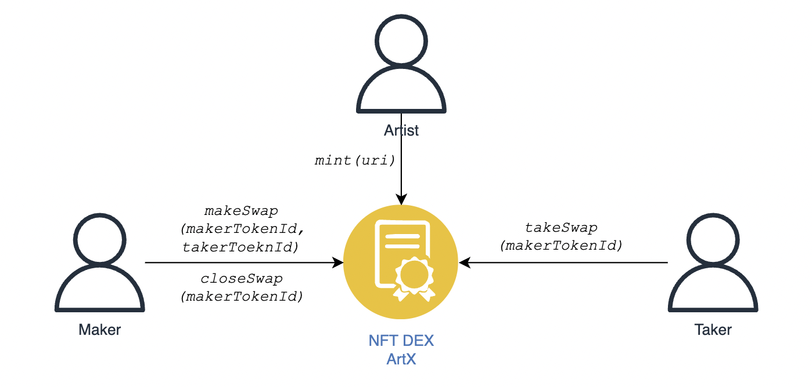

# ArtX Contract

The smart contract for ArtX, including the following functions:

* Create ArtX NFT: creator initiates a call that includes a URI to off-chain meta.
* Propose Swap: _maker_ proposes a swap by specifying her own tokenId and swapped tokenId. A token can only be listed _once_ and subsequent call will overwrite the current listing.
* Take Swap: _taker_ can take a swap listed in the pool. She must own the swapped token.
* Close Swap: _maker_ can delist to close the swap pre-maturely.

